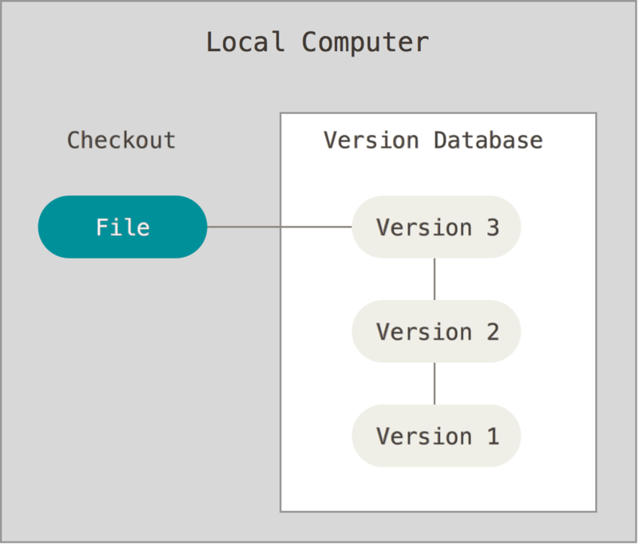
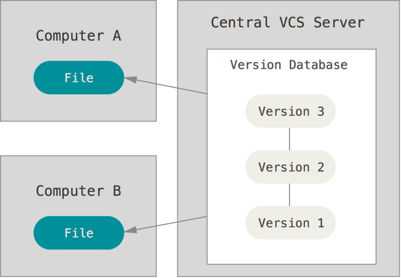
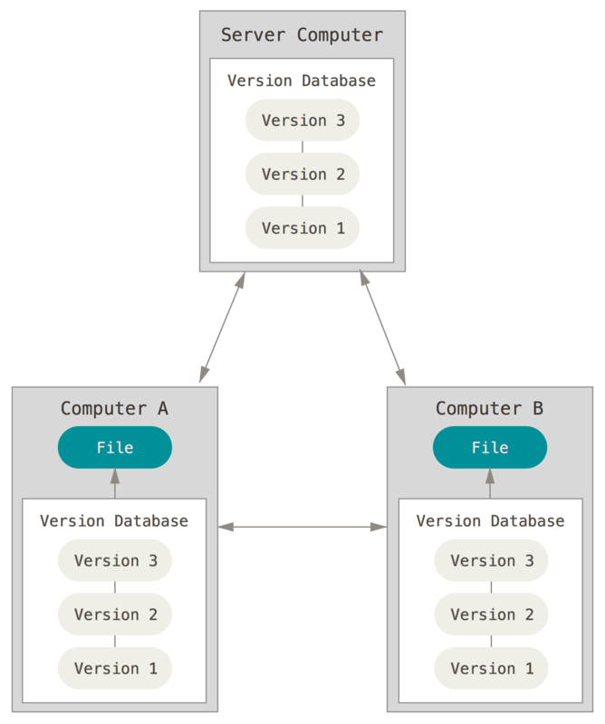
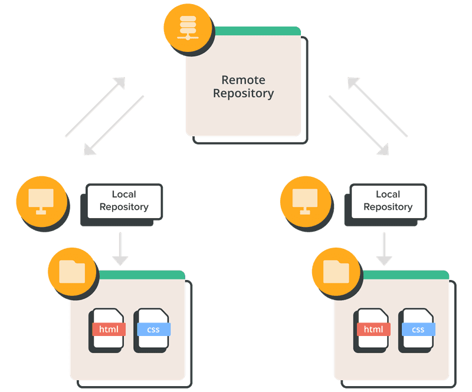
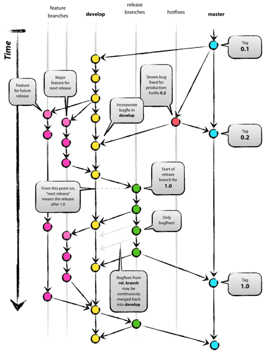

# Git

## Git이란?

Git은 간단하게 얘기해서 형상 관리 도구이다.

소스코드의 버전관리 Version Control System 이라고 하며 짧게 VCS라고 부르기도 한다.

코드의 변경 내역을 버전으로 세부적으로 저장하여 관리하며 코드의 문제가 발생하였을 경우 이전 버전으로의 복귀나 문제가 발생된 지점의 버전 내역 등의 관리가 편해진다.

## 버전관리의 시작

버전 관리 시스템의 시작은 소프트웨어 개발의 복잡성 증대와 협업이 중요시 1972년도에 시작되었다.

소프트웨어 개발 과정에서는 변화되는 코드들을 효과적으로 추적하고 관리할 수 있는 도구가 필요했고 이러한 수요로 인해 여러 가지의 VCS가 등장하게 되었다.

## 버전관리의 구분

### 로컬 버전 관리



자신의 컴퓨터에 모든 정보를 저장하는 방식의 버전 관리이다.

**장점**

1. 간편하게 사용이 가능하다.

**단점**

1. 다른 개발자와의 협업이 힘들다
2. 컴퓨터가 고장날 경우 파일 복구가 힘들다.

### ****중앙집중식 버전 관리****



중앙 서버 컴퓨터에 프로젝트를 넣고 각 개발자는 수정을 할 때 중앙 서버에 있는 파일 중 수정할 파일을 가져와 수정하는 방식

**장점**

1. 다른 개발자들과 협업을 할 수 있다.

**단점**

1. 중앙 서버 컴퓨터가 다운되면 협업이 불가능하다.
2. 중앙 서버 컴퓨터가 고장날 경우 전체 프로젝트 복구가 힘들다
3. 오프라인에서는 작업이 불가능하다.

### ****분산 버전 관리 시스템****



중앙 서버 컴퓨터에 프로젝트가 있고 각 개발자는 프로젝트 자체를 다운받게 되어 개발을 진행하게 된다.

현재의 DVCS 즉 Git도 위와 같은 방식의 시스템을 가지고 있다.

- DVCS : Distributed Version Control System
- Distributed
    - Git은 분산 버전 관리 시스템이고 로컬에 원격 저장소의 모든 데이터를 복제하기 때문에 사실상 개발자 수만큼 백업이 되어 있습니다. 필요하면 원격 저장소를 여러 개 만들 수 있고 다양한 작업방식을 도입할 수 있습니다. 진정한 분산 관리형 시스템입니다.


**장점**

1. 중앙 서버 컴퓨터가 고장난다 해도 협업이 가능하다.
2. 오프라인에서도 작업이 가능하다.

## Git 명령어

명령어는 굉장히 많다. 이 문서는 사용법에 대한 문서가 아니므로 명령어는 정리가 잘 된 블로그를 참고 링크로 넣어둔다.

[참고링크 바로가기](https://subicura.com/git/guide/basic.html#git-init-저장소-만들기)

## 원격저장소와 로컬저장소



저장소는 크게 두가지로 나뉘며 원격저장소와 로컬저장소가 있다.

원격저장소는 Remote 혹은 origin이라고 부르며 로컬저장소는 Local이라고 부른다.

remote 서버에 저장되어 있는 프로젝트를 local로 불러올 때는 pull 명령어를 쓰며

local에서 remote 서버로 업로드 할 때는 push 명령어를 쓴다.

## Git의 3가지 상태

git은 파일을 3가지 형태로 관리를 하게 된다.


- **Modified**
    - 파일이 수정 중인 상태이며 로컬에서 파일을 수정하는 행위이다.
- **Staged**
    - commit이 되기 이전 상태이며 수정된 파일이 add 상태일 때이다.
- **Committed**
    - add된 파일들이 commit이 된 상태이다.


## Git 컨벤션

Git은 수정된 파일을 관리할 때 commit 메세지를 작성하게 된다.

commit 메세지를 남기는 이유는 협업을 하는 개발자나 혹은 개인이 프로젝트를 할 때

해당 commit이 어떤 파일을 왜 수정하였는지를 남기는게 일반적이다.

이러한 메세지 내용을 어느정도 통일시켜 수많은 개발자들이 서로간의 상호작용을 할 수 있도록

Git에는 필수적이지는 않지만 commit 메세지를 남길때  일정한 규칙이 존재하며 이를 git 컨벤션이라고 말한다.

### Commit Message 구조

> 커밋메시지는 기본적으로 제목/본문/꼬리말로 구성된다.
>

```markdown
type(옵션) : [#issueNumber]Subject // 제목
body(옵션) // 본문
footer(옵션) // 꼬리말
```

**type :**

어떠한 작업을 했는지 작성합니다. type 은 정해져 있는 태그가 있기에 아래에서 알아보도록 하겠습니다.

type 뒤에는 띄어쓰기 없이 ':' 를 사용하고 제목 사이에 띄어쓰기를 해줍니다.

**subject :**

제목을 작성합니다. 어떠한 작업을 했는지 간단 명료하게 작성을 해주는 것이 포인트입니다.

최대 50자 이내로 작성을 하며 동사 원형으로 시작을 하고 영어일 경우 첫 글자는 대문자로 작성해주고 마침표를 찍지 않습니다.

**body :**

subject에 작성한 것만으로 설명이 되지 않는 경우 작성을 해줍니다. body에 작성하는 문구는 "무엇을 왜" 하였는지에 대하여 작성을 해주는 것이 원칙이며 72자를 넘기지 않습니다.

**footer :**

필수가 아니며 issue tracker 를 명시하고자 할 때 작성합니다.

> Type
>

| 타입 | 설명 | 예시 |
| --- | --- | --- |
| feat | 새로운 기능 추가 | feat: 회원 가입 기능 추가 |
| fix | 버그 수정 | fix: 로그인 버그 수정 |
| refactor | 코드 리팩토링 | refactor: 데이터베이스 모델 재구성 |
| style | 코드 스타일 변경 (공백, 포맷 등) | style: 들여쓰기 및 코드 포맷 수정 |
| docs | 문서 업데이트 | docs: API 문서 업데이트 |
| chore | 빌드 프로세스 또는 도구 관련 작업 | chore: 빌드 스크립트 업데이트 |
| test | 테스트 추가 또는 수정 | test: 유닛 테스트 케이스 추가 |
| perf | 성능 향상 관련 작업 | perf: 검색 알고리즘 최적화 |
| security | 보안 관련 수정 | security: 사용자 데이터 암호화 |
| revert | 이전 커밋의 변경 사항 되돌리기 | revert: "feat: 새로운 레이아웃 추가" 되돌리기 |

> Commit 메세지 예시
>

```markdown
feat: Summarize changes in around 50 characters or less

More detailed explanatory text, if necessary. Wrap it to about 72
characters or so. In some contexts, the first line is treated as the
subject of the commit and the rest of the text as the body. The
blank line separating the summary from the body is critical (unless
you omit the body entirely); various tools like `log`, `shortlog`
and `rebase` can get confused if you run the two together.

Explain the problem that this commit is solving. Focus on why you
are making this change as opposed to how (the code explains that).
Are there side effects or other unintuitive consequences of this
change? Here's the place to explain them.

Further paragraphs come after blank lines.

- Bullet points are okay, too

- Typically a hyphen or asterisk is used for the bullet, preceded
by a single space, with blank lines in between, but conventions
vary here

If you use an issue tracker, put references to them at the bottom,
like this:

Resolves: #123
See also: #456, #789
```

- 예시는 Udacity의 메세지 가이드이다. [참고링크](https://udacity.github.io/git-styleguide/)

## Git Branch

Git에서의 작업은 Branch라는 곳 에서 이루어진다.

Branch는 어떠한 작업을 수행하는 독립적인 공간이라고 생각하면 된다.

Branch의 구성은 기본적으로 존재하는 Main이 있고 자유롭게 추가적으로 생성이 가능하다.

Main에는 완성형태의 코드들이 존재하는 곳이며 외에 브런치는 특정한 목적을 가지고 만들면 된다.

Branch는 자유롭게 생성이 가능하다고 했지만 많은 개발자들이 전략적인 개발을 위해 사용하는 브런치 전략들이 있다.

아래에서 전략 중 하나인 Gitflow 전략을 보도록 하자.

## Gitflow



### **Main**

- 중심이 되는 2개의 branch 중 하나로 라이브서버에서 사용되는 branch로 태깅을 통해 버전관리

### **Develop**

- 중심이 되는 branch로 차기 버전을 위한 개발의 메인으로 추가 기능 개발시 Develop branch에서 Feature branch를 생성
- 개발이 완료된 기능은 Develop branch로 merge

### **Feature**

- Feature branch는 origin에 반영되는게 아닌, 개발자의 Local Repo에 존재
- Merge가 완료되면 branch는 삭제

### **Release**

기능개발이 완료되어 차기 릴리즈를 위한 준비가 되면 Develop branch에서 생성

- 이 시점부터 Develop branch에는 추후 버전을 위한 개발이 가능

Release branch에는 버그픽스를 위한 수정만 커밋되고, 버그픽스가 완료되면 Main branch, Developer branch의 두곳에 merge

- Main branch에 tagging을 통해 릴리즈버전을 기록

### **Hotfix**

라이브환경에서 버그가 발생하면 Master branch에서 생성.

수정 완료 후 Main branch, Developer branch의 두곳에 merge

- Main branch에 tagging을 통해 핫픽스 릴리즈버전을 기록
- Release branch가 있다면 해당 branch에도 merge 필요