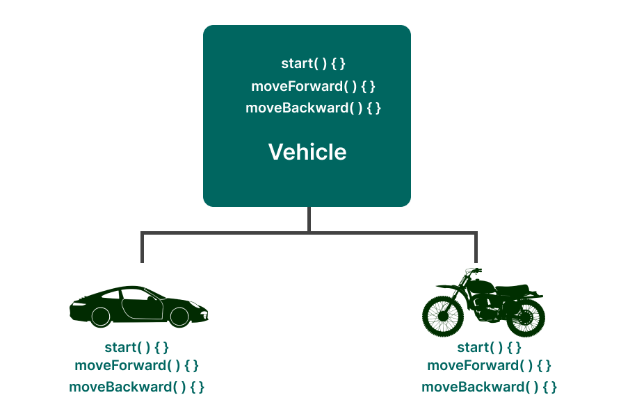
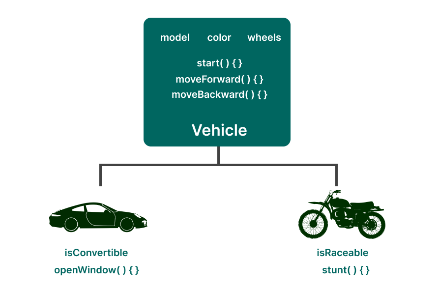
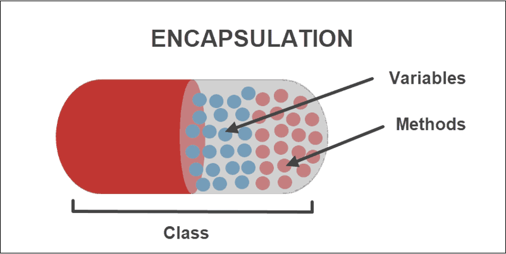

# 객체지향 프로그래밍 (Object Oriendted Programming, OOP)

---

## 객체지향 프로그래밍 등장 배경

---

### 절차적 프로그래밍

- 명시된 입력을 받아 **명시된 순서로 처리**하여 결과를 내는 방식의 프로그래밍 방법
- 순서대로 처리한다는 것이 주요 쟁점이다.
- 조금만 복잡해져도 순서도로 나타내는 것이 어렵다.
- ex) C언어 …

### 구조적 프로그래밍

- 프로그램을 함수단위로 나누고 함수끼리 호출하는 방식의 프로그래밍 방법
- **큰 문제 → 작은 문제** (Top-Down : 하향식)
- 해당 문제의 고유한 디자인을 만들어내는 경향이 있으므로, 재사용이 어렵다.
- ex) 파스칼(Pascal) …

## 객체지향 프로그래밍이란?

---

- 프로그래밍 개발방법론
- 프로그래밍에 필요한 **데이터를 추상화** 시켜 상태와 행위를 가진 **객체를 만들고** 객체들 간의 **상호작용을 통해**서 로직을 구성하는 프로그래밍 방법이다.
- **작은 문제 → 큰 문제** (Bottom-Up : 상향식)
- 프로그램을 유연하고 변경이 쉽게 만들기에 개발과 보수를 간편하게 한다.
- ex) Java, C++, Python …

## 객체란?

---

- 현실의 실체나 개념을 프로그래밍에서 모델링한 것
- 어떠한 상태나 행동을 갖는 데이터

## 기본 구성 요소

---

### 클래스 (Class)

- 같은 종류의 집단에 속하는 속성(Attribute)와 행위(Behavior)를 정의한 것
- 다른 클래스나 외부 요소와는 독립적으로 디자인되어야한다.

### 객체 (Object)

- 클래스의 인스턴스 (실제로 메모리상에 할당)
- 고유한 속성을 가지며, 클래스에서 정의한 행위를 수행할 수 있다.

### 메서드 (Method)

- 클래스로부터 생성된 객체를 사용하는 방법으로 객체의 속성을 조작하는 데 사용된다.
- 객체에 명령을 내리는 메시지이며, 객체 간의 통신은 이 메시지를 통해 이루어진다.

## 특징

---

### 1. 추상화

- 객체의 공통적인 속성과 기능을 추출하여 정의하는 것
- 불필요한 정보는 숨기고 중요한 정보만을 표현하여 프로그램을 간단히 만드는 것
- Java - abstract, interface → 역할과 구현의 분리
- 보다 유연하고 변경에 열려있는 프로그램의 설계를 가능하게 한다.

### 2. 상속

- 상위 클래스의 속성과 행위를 하위 클래스가 물려받는 것
- 새로운 클래스가 기존의 클래스의 자료와 연산을 이용할 수 있게 하는 기능
- 재사용을 가능하게 함으로써 반복적인 코드를 최소화하며 공유하는 속성과 기능에 간편하게 접근하여 사용이 가능하다.
- Java - extends

### 3. 다형성

- 어떤 객체의 속성이나 기능이 맥락에 따라 다른 역할을 수행할 수 있는 성질
- 상위 클래스 타입의 참조 변수로 하위클래스 객체를 참조하는 것
- 간편하고 유연하게 코드를 작성하는 것이 가능해진다.
- Java - 메서드 오버라이딩, 메서드 오버로딩

### 4. 캡슐화

- 서로 연관있는 속성과 기능들을 하나의 캡슐로 만들어 데이터를 외부로부터 보호하고 (데이터 보호), 필요한 부분만 외부로 노출(데이터 은닉)될 수 있도록 하여 객체 고유의 독립성과 책임 영역을 안전하게 지키는 것
- 객체의 자율성을 높여 객체 간 결합도를 낮추도록 설계가 가능해진다.
- Java - 접근 제어자(public, default, protected, private) , getter/setter

## 객체 지향 프로그래밍의 장점 / 단점

---

### 장점

- 클래스의 데이터형을 사용함으로 응집력을 강화하고, 각 클래스를 독립적으로 디자인하여 결합력은 약하게 한다.
- 코드의 변경을 최소화하고 유지보수를 하는 데 유리하다.
- 보다 직관적인 코드 작성이 가능하다.
- 코드 재사용을 통해 반복적인 코드를 최소화하고, 간결하게 표현할 수 있다.

### 단점

- 처리 속도가 상대적으로 느리다.
- 설계에 많은 시간과 노력이 필요할 수 있다.
- 객체가 많을수록 프로그램의 용량이 커진다.

## 객체 지향 설계 원칙 (SOLID)

---

### 1.  단일 책임 원칙 (SPR, Single Responsibility Principle)

- 클래스는 단 하나의 책임만 가져야 하며, 오직 하나의 변경의 이유를 가져야한다.
- 클래스의 목적을 명확히 한다.

### 2. 개방-폐쇄 원칙 (OCP, Open-Closed Principle)

- 확장에는 열려 있으나, 변경에는 닫혀 있어야 한다.
- 변경 사항 발생 시 유연하게 코드를 추가함으로 기능을 확장하고, 객체를 직접적으로 수정하는 것은 제한한다.

### 3. 리스코프 치환 원칙 (LSP, Liskov Substitution Principle)

- 상위 타입의 객체를 하위 타입의 객체로 치환해도, 상위 타입을 사용하는 프로그램은 정상적으로 동작해야 한다.
- 다형성 원리를 이용하기 위한 원칙

### 4. 인터페이스 분리 원칙 (ISP, Interface Segregation Principle)

- 인터페이스는 인터페이스를 사용하는 클라이언트를 기준으로 분리해야 한다.
- 인터페이스의 단일 책임을 강조
- 클라이언트의 목적과 용도에 적합한 인터페이스 만을 제공하는 것을 목표로 한다.

### 5. 의존 역전 원칙 (DIP, Dependency Inversion Principle)

- 고수준 모듈은 저수준 모듈의 구현에 의존해서는 안된다.
- 대상의 상위 요소로 참조하라.

## 참조

---

- [객체지향 프로그래밍 특징](https://www.codestates.com/blog/content/%EA%B0%9D%EC%B2%B4-%EC%A7%80%ED%96%A5-%ED%94%84%EB%A1%9C%EA%B7%B8%EB%9E%98%EB%B0%8D-%ED%8A%B9%EC%A7%95)
- [객체 지향 설계 원칙](https://inpa.tistory.com/entry/OOP-%F0%9F%92%A0-%EA%B0%9D%EC%B2%B4-%EC%A7%80%ED%96%A5-%EC%84%A4%EA%B3%84%EC%9D%98-5%EA%B0%80%EC%A7%80-%EC%9B%90%EC%B9%99-SOLID)