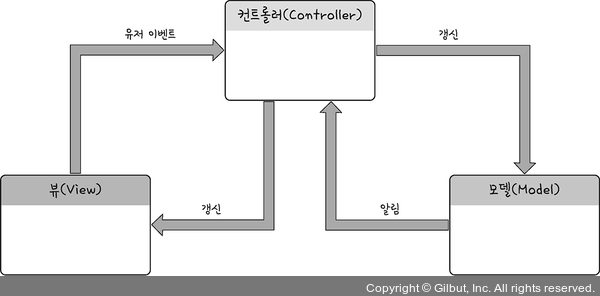

# MVC 패턴

## 디자인패턴이란?

> 정형화된 문제해결 방법론

객체지향 프로그래밍의 세상에서는 여러 객체들끼리 서로 메세지를 주고받으면서 프로그램 안에서 일처리를 해간다.  
그 과정에서 객체를 너무 중구난방으로 만들어 놓으면 자신이 뭘 해야할지 모르는 상황이 발생한다.  
그래서 몇가지 패턴들을 만들어 놓은것이다.  
객체들 마다 각자의 일을 지정해 놓는것이 효율적이라고 판단해 정해놓은 것이 디자인 패턴이다.  

> 디자인패턴의 핵심은 **객체의 역할과 책임**

## MVC 패턴이란?

**MVC 패턴이란 Model, View, Controller 라는 세가지의 역할로 객체들이 해야 할 일과 역할과 책임을 나누어 놓는것**

### Model

> 데이터관리

프로그램이 저장하고 불러오는 데이터, 사용자들이 저장하고 읽어오는 데이터 등을 관리하는 객체가 모델 객체이다.  
모델은 데이터와 행동을 갖는 객체이고 비즈니스 로직을 수행한다.

### View

> 사용자에게 보여지는 역할

사용자에게 보여지는 객체를 모두 뷰라고 한다.  
뷰는 데이터를 시각화하는 것이고, 모델이 처리한 데이터를 컨트롤러를 통해서 받아서 사용해야 되기 때문에 어떤 데이터나 로직이 들어가면 안된다.

### Controller

> Model과 View 사이의 중간다리

모델과 뷰 사이의 징검다리 역할로 제어 및 통신을 담당하고 뷰와 모델을 분리시키는 역할을 하는 객체이다.  
컨트롤러는 사용자의 요청을 해석해서 처리하고 결과를 반환하는 역할을 한다.  
MVC 패턴에서 유일하게 다른 컴포넌트들의 존재를 알고 있는 컴포넌트이기 때문에 데이터의 흐름을 제어한다.

### MVC 흐름도

1. 사용자가 뷰와 연결
2. 사용자가 뷰한테 버튼을 클릭한다는 등의 유저 이벤트를 발생
3. 컨트롤러가 받게 됨
4. 컨트롤러는 그 액션을 받아서 모델한테 뷰가 보낸 액션을 전달
5. 모델은 요청을 받아들여 DB 정보를 가져오거나 갱신하는 등의 액션을 함
6. 그 결과를 컨트롤러에게 전달
7. 컨트롤러는 모델에게 받은 결과를 뷰에게 전달
8. 뷰는 사용자에게 결과가 보여짐

## MVC 패턴 장단점
### 장점

> 애플리케이션의 구성 요소를 세 가지 역할로 구분하여 개발 프로세스에서 각각의 구성 요소에만 집중해서 개발 가능  
> 재사용성과 확장성이 용이

뷰와 모델이 서로 상관관계가 없는 상태이고 간섭이 없으면 뷰만 새로운 버전의 뷰로 변경해 동일한 컨트롤러와 모델을 넣어줄수 있다.  
모델도 똑같이 현재 데이터 처리하는 부분을 변경하고 싶을 때 동일한 뷰와 컨트롤러를 사용하고 모델만 변경할 수 있다.  
이런 이점으로 Controller라는 중간다리 역할이 있는 것이다.

### 단점

> 애플리케이션이 복잡해질수록 컨트롤러가 비대해질 수 있다.

어플리케이션이 복잡해질수록 컨트롤러와 뷰가 강하게 결합되는 문제가 있다.  
컨트롤러가 모델과 뷰 간의 징검다리 역할을 수행하면서 Controller의 역할이 커지고, 복잡한 비즈니스 로직이 컨트롤러에 집중될 수 있다.  
이는 컨트롤러의 복잡성을 증가시킬 수 있고, 유지보수와 테스트의 어려움을 초래할 수 있다.  
