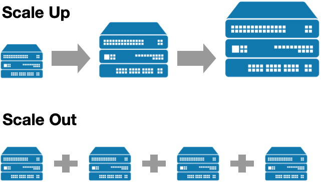

### 목차

[1. 들어가기](#1-들어가기-)
- 1-1 면접에서 질문하는 의도는?
- 1-2 SQL과 NoSQL 큰 틀에서 보기

[2. SQL(RDB)](#2-sqlrdb)
- 2-1 RDB 특징
- 2-2 RDBMS

[3. NoSQL](#3-nosql)
- 3-1 NoSQL 특징
- 3-2 NoSQL 종류

[4. SQL vs NoSQL](#4-sql-vs-nosql)
- 4-1 비교하기
- 4-2 각각 어떤 상황에서 쓰일까?
- 4-3 관련 면접 질문들
--- 
<br>

# 1. 들어가기 🚪

---
## 1-1 면접에서 질문하는 의도 <br><br>

### 1. 데이터 관리 이해: DB 관리 시스템의 기본 개념을 이해하고 있는지 확인

SQL(관계형 데이터베이스)와 NoSQL(비관계형 데이터베이스)은 데이터를 저장, 조회, 관리하는 방법이 다릅니다.<br> 면접관은 지원자가 이 두 시스템의 차이점을 이해하고 있는지 확인하고 싶어할 것입니다. <br><br>

### 2. 기술 선택의 근거: 프로젝트나 특정 상황에 따라 적절한 데이터베이스를 선택할 수 있는 능력을 평가
SQL은 엄격한 데이터 구조를 가지며, 정규화와 정밀한 트랜잭션을 통해 안정성을 제공하는 반면,<br> NoSQL은 유연성, 확장성, 빠른 읽기/쓰기 속도를 제공합니다.<br><br>


### 📌 정리<br>
**데이터 무결성**이 필요한 경우 `SQL` 선택<br> **대용량 데이터를 다루고 빠른 성능과 확장성이 필요**한 경우에는 `NoSQL`을 선택
<br><br><br>

## 1-2 SQL과 NoSQL 큰 틀에서 보기 <br><br>

  <br><br><br>


# 2. SQL(RDB)

---

## 2-1 RDB 특징

RDB(Relational Database)는 관계형 데이터 모델에 기초를 둔 데이터베이스입니다.

특징으로는 서로 다른 **테이블들이 관계를 맺고 있으며,** **스키마를 통해 데이터 구조를 엄격하게 정의**한다는 것 입니다.<br><br>

 <br><br>

  <br><br><br><br>


## 2-2 RDBMS

RDBMS는 **강력한 트랜잭션 처리**를 지원하며, 데이터의 **무결성**을 보장하여 데이터 처리를 안전하게 한다는 특징이 있습니다. <br><br>

### 1. MySQL
- 오픈소스
- **경량성과 사용 편의성**
- **웹 기반 애플리케이션에 널리 사용**되며, 강력한 커뮤니티 지원
- 복잡한 트랜잭션 처리에 있어 PostgreSQL이나 Oracle에 비해 기능적으로 제한적

### 2. MariaDB
- 오픈소스
- **MySQL과 높은 호환성**
- **MySQL의 기능을 확장하고 최적화함**
- 시장 점유율이 상대적으로 낮음

### 3. Oracle
- 상업용
- **뛰어난 성능**
- 대규모 시스템에 많이 사용됨
- 복잡한 트랜잭션과 대용량 데이터 관리에 최적화
- **높은 비용**, 기능이 많아 초보자가 사용하기에 어려울 수 있음

### 4. PostgreSQL
- 오픈소스
- **객체 관계형 DBMS**
- **복잡한 쿼리와 대규모 데이터 처리에 강점**
- 뛰어난 트랜잭션 처리, ACID 규약을 완전히 준수
- 관리의 복잡성, 성능 최적화가 MySQL에 비해 더 필요<br><br><br><br>


# 3. NoSQL

---
## 3-1 NoSQL 특징
- NoSQL(Not Only SQL)은 관계형 베이스의 한계를 극복하기 위해 처음 등장하였고,<br> 
일반적으로 관계형 데이터베이스보다 덜 제한적이고 유연하며 확장성 있다는 특징을 가지고 있습니다.


### 💡 NoSQL 데이터베이스의 종류는 크게 네 가지로 분류됩니다.<br>

 <br><br><br>

## 3-2 NoSQL 종류
### 🔑 Key-Value 구조

Java의 HashMap 자료구조와 같이 Key 하나에 Value 데이터가 전달되는 구조이며,<br> 이 구조는 특히 **빠른 데이터 접근을 위해 최적화되어 있습니다**. 대표적인 DB로는 `Redis`가 있습니다. <br><br>

- #### **Redis 특징**
  - 간결한 Key-Value 구조를 사용 사용하고, 인 메모리(데이터를 RAM에 저장) 구조를 활용하여,<br> **빠른 데이터 처리/응답이 필요한 상황에서 뛰어난 속도를 제공**합니다.
  - MySQL과 같은 메인DB를 두고 서브DB로 많이 쓰이는데, **캐싱, 세션 관리**,<br> pub/sub, 인증 토큰(refresh token) 저장 등에 사용됩니다.
  - 한 Redis 인스턴스 내에 다양한 타입의 데이터를 저장할 수 있습니다. <br>

<br><br>

#### 💡 Redis 가 빠른 이유? <br>
Redis는 데이터 접근 시 key 값으로 value를 즉시 찾을 수 있는 **해시**를 사용하여 시간 복잡도가 O(1)이 걸리며,<br>
RDBMS의 MySQL의 경우 인덱스가 없는 경우 **풀스캔**을 해야하므로 시간 복잡도가 O(n)이 소요됩니다.<br> (인덱스가 있는 경우 O(log n)으로 개선되지만 그래도 레디스의 O(1) 보다는 느립니다)

이로 인해 **Redis는 서비스가 성장해서 데이터량이 많아져도 응답 속도가 보장**이 되므로, 리스크가 적습니다. <br><br><br>

### 📂 Document 구조
**데이터를 테이블이 아닌 문서처럼 저장하는 형태**이며, **JSON 형태의 데이터를 BSON(Binary JSON)으로 문서화 하여 저장**하며,<br> 컬렉션이라고 하는 그룹으로 묶어서 관리됩니다. 대표적인 DB로는 `MongoDB`가 있습니다. <br><br>

- #### **MongoDB 특징**
  - **문서 지향** 데이터베이스 입니다.
  - **유연한 스키마**를 가지며, 이로 인해 요구 사항이 변화함에 따라 데이터베이스 스키마를 쉽게 조정할 수 있습니다. <br><br>
    <br><br><br>
    <br><br><br>

#### 💡 MongoDB의 스키마 변경이 자유로운 이유 <br>

서로 연관된 관계형 데이터베이스에서 스키마를 변경하는 것은 위험할 수 있습니다.<br>
이는 다른 테이블 데이터에 영향을 미쳐 문제를 일으킬 수 있기 때문입니다.

반면에 MongoDB는 스키마를 변경하려면 document에 필드를 추가,변경 또는 제거하면 되는데,<br>
한 collection 안의 document들은 각각 다른 필드를 가질 수 있기 때문에<br> 이러한 변경이 다른 document에
영향을 미치지 않습니다.<br><br><br>

나머지 NoSQL 데이터베이스는 **그래프 구조** DB로는 대표적으로 `Neo4j`가 있고, **컬럼 패밀리 구조** DB는 `Cassandra`가 있으며,<br> 이 외에도 **Key-Value 구조이면서 Document 기능도 포함**한 DB인  `DynamoDB` 가 있습니다. <br><br><br><br>


# 4. SQL vs NoSQL

---
## 4-1 비교하기

### **1. Scalability(확장성)** <br>

 <br><br>

💡 서비스 규모가 커지고, 사용자 수가 증가하며, 데이터 처리 요구사항이 늘어나는 상황에서 데이터를 안정적으로 처리하기 위해 사용하는 전략 <br>
`Scale Up`, `Scale Out` <br><br>

**수직적 확장성(Scale Up): RDBMS**
- **서버의 성능을 향상시키는 방식**으로, 더 많은 CPU, RAM, SSD 등의 **자원을 추가**하는 것을 의미합니다.
- **하나의 서버를 사용**하는 중앙집중형 방식으로 인해, 데이터 자주 바뀌는 경우에도 **일관성과 무결성을 유지**합니다.

**수평적 확장성(Scale Out): NoSQL**
- **서버의 개수를 늘리는 방식**으로, 여러 서버에 **데이터베이스를 분산**시키는 것을 의미합니다.
- **확장에 용이**해서 대용량 데이터 처리와 높은 트래픽을 관리하는데 적합합니다. <br><br>

```
💡 분산 시스템이란?

데이터를 여러 대의 컴퓨터 노드에 분산하여 저장하고 처리하는 시스템을 말합니다. 
병렬 구조로 인해 노드 중 하나가 다운되어도 시스템 전체가 중단되지 않도록 하여 가용성을 높여주고, 
각 노드는 자신에게 해당되는 일부 데이터만 처리하도록 하여 빠른 처리가 가능합니다.
```
<br>

### **2. 스키마**
**RDBMS의 강한 스키마**
- **테이블을 생성할 때 열, 데이터 타입이 미리 정의되어야 하며**, 데이터는 이 스키마에 엄격하게 맞춰 저장됩니다.
- 데이터의 **일관성과 무결성을 보장**하지만, 유연성과 확장성에 제약이 있습니다. <br>

**NoSQL의 자유로운 스키마**
- **유연한 데이터 구조**를 가지며, 언제든지 데이터를 조정하고 새로운 필드를 추가할 수 있습니다.
- 데이터의 무결성을 보장하기 어렵고, 중복 데이터가 발생할 수 있습니다.  <br><br><br>

## 4-2 각각 어떤 상황에 쓰일까?

**RDBMS**
- 데이터 무결성 및 일관성이 중요한 트랜잭션 업무
- 데이터간 관계를 맺고 있으며, 데이터가 자주 업데이트 되는 경우
- JOIN 연산과 INDEX 관리가 중요한 경우

**NoSQL**
- 대용량 데이터를 다루고 높은 확장성이 요구되는 경우
- 데이터 읽기 작업과 쓰기 작업이 빈번한 경우
- 로그 및 이력 등의 단순 기록형 업무 <br><br><br>

## 4-3 관련 면접 질문들

<br>

**Q1. SQL과 NoSQL을 비교해서 설명해주세요.**

SQL은 정해진 스키마를 통해 데이터 무결성을 보장하며, 수직적 확장성에 의존하는 특징이 있습니다. <br>

반면, NoSQL은 스키마가 없어 데이터 구조의 자유로운 변경과 수평적 확장을 가능하게 하지만,<br> 데이터 중복이 발생하거나 데이터 변경 시 연산이 지연될 수 있습니다.

<br>

**Q2. RDBMS와 NoSQL은 어느 경우에 적합한가요?**

RDBMS은 데이터 무결성과 일관성이 중요한 트랜잭션 업무에 적합하며<br> 데이터 간 관계를 맺고 자주 업데이트되는 환경에서 효율적입니다.<br>

반면에, NoSQL은 대용량 데이터 처리와 높은 확장성이 중요한 환경에 적합하며<br> 데이터 읽기 작업과 쓰기 작업을 많이 하는 경우에 유리합니다.

<br>

**Q3. Redis에 대해 설명해주세요**

Redis는 인메모리 기반의 Key-Value 구조를 가진 NoSQL 데이터베이스입니다.<br> 싱글 스레드로 동작하며, 캐싱 및 세션 관리 등에 사용됩니다.

<br>

---
#### 🔖 Reference.
[[DB] RDB 관계형 데이터베이스란 무엇일까?](https://danhandev.tistory.com/entry/DB-RDB-%EA%B4%80%EA%B3%84%ED%98%95-%EB%8D%B0%EC%9D%B4%ED%84%B0%EB%B2%A0%EC%9D%B4%EC%8A%A4%EB%9E%80-%EB%AC%B4%EC%97%87%EC%9D%BC%EA%B9%8C)<br>
https://yunyoung1819.tistory.com/201 <br>
https://benlee73.tistory.com/178 <br>
https://aws.amazon.com/ko/nosql/ <br>
[[백엔드 로드맵 - DB] SQL vs NoSQL](https://velog.io/@sierra9707/%EB%B0%B1%EC%97%94%EB%93%9C-%EB%A1%9C%EB%93%9C%EB%A7%B5-DB-SQL-vs-NoSQL)<br>
https://www.youtube.com/watch?v=CjsVx9sARDU <br>
https://www.youtube.com/watch?v=cnPRFqukzek <br>
https://bruno-jang.tistory.com/34 <br>
