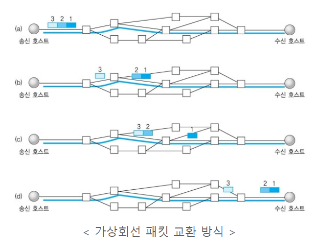
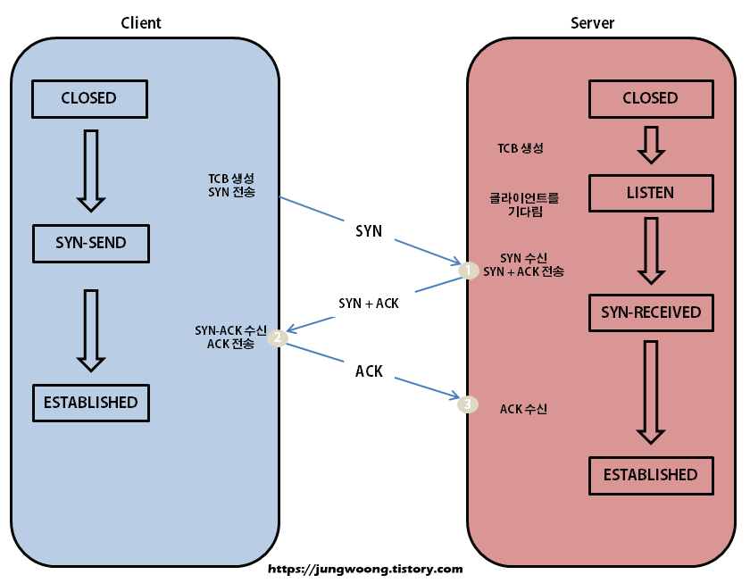
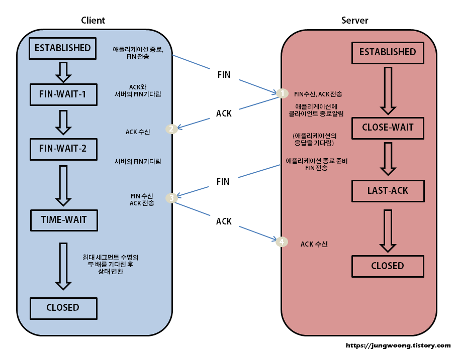
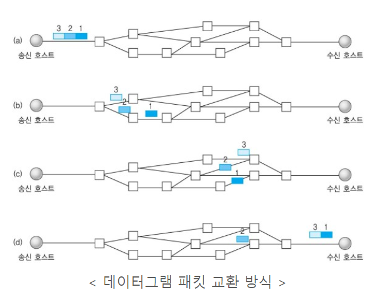

# TCP/IP와 UDP

## TCP/IP 4계층

Transmission Control Protocol / Internet Protocol

컴퓨터와 컴퓨터간의 지역네트워크(LAN) 혹은 광역네트워크(WAN)에서 원활한 통신을 가능하도록 하기 위한 통신규약

## 전송계층 (Transport Layer)

데이터를 효율적이고 안정적으로 전달하는 역할의 계층

네트워크 양 끝단(송신자 - 수신자, End to End)간의 연결을 제공하는 계층

(데이터가 시작지부터 목적지까지 중간에 개입이나 변형 없이 안전하게 전달되어야한다는 원칙)

주요 프로토콜 : TCP / UDP

## TCP

Transmission Control Protocol

연결 지향형 프로토콜

데이터의 신뢰성 있는 전송을 보장하는 프로토콜

반드시 수신자가 정보를 받아야하는 신뢰성 있는 통신(ex. e-mail)이 필요할 때 사용

전이중(Full-Duplex), 점대점(Point to Point)방식

가상 회선 방식을 사용 : 전송 순서대로 데이터 수신

3-way handshake / 4-way handshake를 통해 연결 설정 및 연결 해제

### 3-way handshake

연결 설정을 위한 과정

양쪽 모두 데이터를 전송할 준비가 되었다는 것을 보장

데이터 전달 시작 전 한쪽이 다른쪽에 준비되었다는 것을 알린다.

1. 클라이언트 -> 서버 : 접속을 요청하는 SYN 패킷을 보낸다. / SYN (SEQ : 1000 , ACK : -)
2. 서버 -> 클라이언트 : SYN 요청을 받고 요청을 수락한다는 SYN + ACK 패킷을 발송하고 ACK 응답을 기다린다. / SYN + ACK (SEQ : 2000 , ACK : 1001)
3. 클라이언트 -> 서버 : ACK 응답을 보낸 이후 연결이 이루어진다. / ACK (SEQ : 1001 , ACK : 2001)

### 4-way handshake

연결 해제를 위한 과정

1. 클라이언트 -> 서버 : 연결을 종료하겠다는 FIN flag 전송 / FIN (SEQ : 5000 , ACK : -)
2. 서버 -> 클라이언트 : 먼저 응답 메시지 보낸 후 자신의 통신이 끝날때까지 대기 / ACK (SEQ : 7500 , ACK : 5001)
3. 서버 -> 클라이언트 : 통신이 끝나면 연결이 종료되었다는 FIN flag 전송 / FIN (SEQ : 7501 , ACK : 5001)
4. 클라이언트 -> 서버 : 확인했다는 메시지를 보낸다. / ACK (SEQ : 5001 , ACK : 7502)

## UDP

User Datagram Protocol

비연결 지향형 프로토콜

데이터의 신뢰성 있는 전송을 보장하지 않는 프로토콜
-> 데이터 수신 여부를 확인하지 않는다.

신뢰성보다는 연속성 있는 전송(ex. 실시간 스트리밍)이 필요한 경우에 사용

1대1 연결방식이 아니기에 여러 수신자에게 한 번에 전송이 가능

데이터그램 패킷 교환 방식을 사용 : 논리적인 경로 없이 각가의 패킷은 다른 경로로 전송되며, 독립적인 관계를 지닌다.

## TCP vs UDP

|       | TCP | UDP |
|-------|----|----|
| 연결 방식 | 연결형 서비스 | 비연결형 서비스 |
| 패킷 교환 | 가상 회선 방식 | 데이터그램 방식 |
| 전송 순서 보장 | 보장함 | 보장하지 않음 |
| 신뢰성   | 높음 | 낮음 |
| 전송 속도 | 느림 | 빠름 |

### 참조

- [TCP와 UDP의 특징 및 차이점 알아보기](https://dev-coco.tistory.com/144)
- [TCP 연결 과정](https://jungwoong.tistory.com/10)
- [TCP / UDP 개념](https://inpa.tistory.com/entry/NW-🌐-아직도-모호한-TCP-UDP-개념-❓-쉽게-이해하자#🤝_3-way_handshake_과정)

