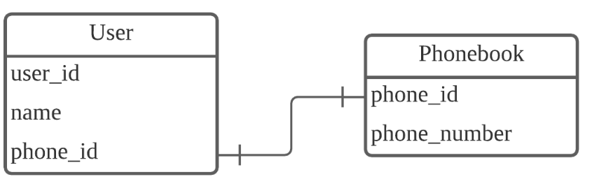
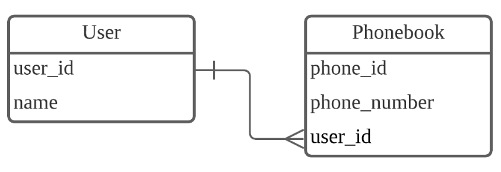
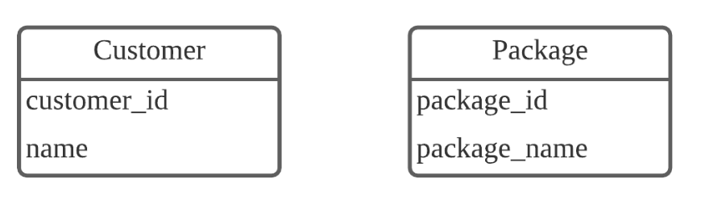
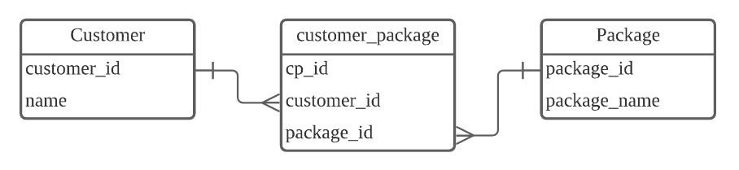
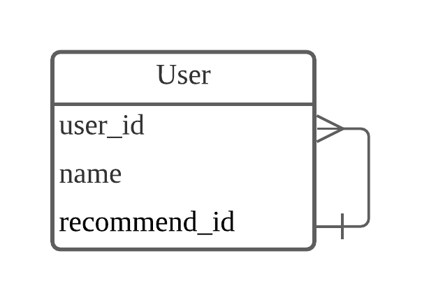

# DB 관계
> 데이터베이스 내 어떤 테이블들이 서로 어떻게 연결되어 있는지 나타낸 것

## 관계형 데이터베이스
- 구조화된 데이터는 하나의 테이블로 표현할 수 있다.
- 사전에 정의된 테이블을 Relation 이라고도 부르기 때문에, 테이블을 사용하는 데이터베이스를 관계형 데이터베이스(Relational database)라고 한다.

## 관계형 데이터베이스 키워드 정리
- 테이블(table or relation) : 사전에 정의된 열의 데이터 타입대로 작성된 데이터가 행으로 축적된다.
- 칼럼(column or field) : 테이블의 한 열을 가리킨다.
- 레코드(record or tuple) : 테이블의 한 행에 저장된 데이터이다.
- 키(key) : 테이블의 각 레코드를 구분할 수 있는 값이다.
각 레코드마다 고유한 값을 가진다. 
기본키(Primary Key)와 외래키(Foreign Key)등이 있다.

## DB 관계 종류

### 일대일(1:1)

- 하나의 레코드가 다른 테이블의 레코드 한 개와 연결된 경우이다.
- 각 전화번호가 단 한 명의 유저와 연결되어 있고, 그 반대도 동일하다면 1:1 관계이다.
- 1:1 관계는 자주 사용하지 않는다.
- 1:1로 나타낼 수 있는 관계라면 User 테이블에 phone_id를 대신해 phone_number를 직접 저장하는 것이 나을 수 있다.

### 일대다(1:N)

- 하나의 레코드가 서로 다른 여러 개의 레코드와 연결된 경우이다.
- 한 명의 유저가 여러 전화번호를 가질 수 있다.
- 여러 명의 유저가 하나의 전화번호를 가질 수는 없다.
- 1:N 관계는 관계형 데이터베이스에서 가장 많이 사용한다.

### 다대다(N:N)

- 여러 개의 레코드가 다른 테이블의 여러 개의 레코드와 관계가 있는 경우이다.
- N:M 관계를 위해 스키마를 디자인할 때에는 Join 테이블을 만들어 관리한다.
- N:M 관계는 두 개의 1:N 관계와 그 모양이 같다.

- customer_package 테이블에서는 고객 한 명이 여러 개의 여행 상품을 가질 수 있고. 여행 상품 하나가 여러 개의 고객을 가질 수 있다.
- customer_package 테이블은 customer_id와 package_id를 묶어주는 역할이다.
- customer_package 테이블을 통해 어떤 고객이 몇 개의 여행 상품을 구매했는지 또는 어떤 여행 상품이 몇 명의 고객을 가지고 있는지 등을 확인할 수 있다.
- 조인 테이블을 생성하더라도, 조인 테이블을 위한 기본키(cp_id)는 반드시 있어야 한다.

### 자기 참조 관계(Self Referencing Relationship)

- User 테이블의 recommend_id는 같은 User 테이블의 user_id와 연결되어 있다.
- 한 명의 사용자(user_id)는 한 명의 추천인(recommend_id)을 가질 수 있다.
- 하지만 한 명의 추천인(recommend_id)은 여러 명의 사용자(user_id)에게 추천인으로 등록될 수 있다.
- 해당 관계는 1:N 관계와 매우 유사하다. 하지만, 일반적으로 1:N 관계는 서로 다른 테이블의 관계를 나타낼 때 사용하는 표현이다.

출처: https://ittrue.tistory.com/201 [IT is True:티스토리]