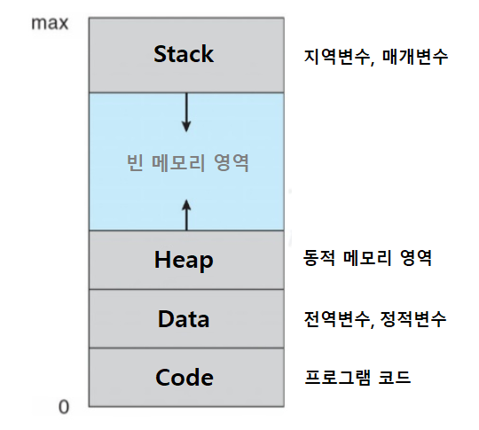
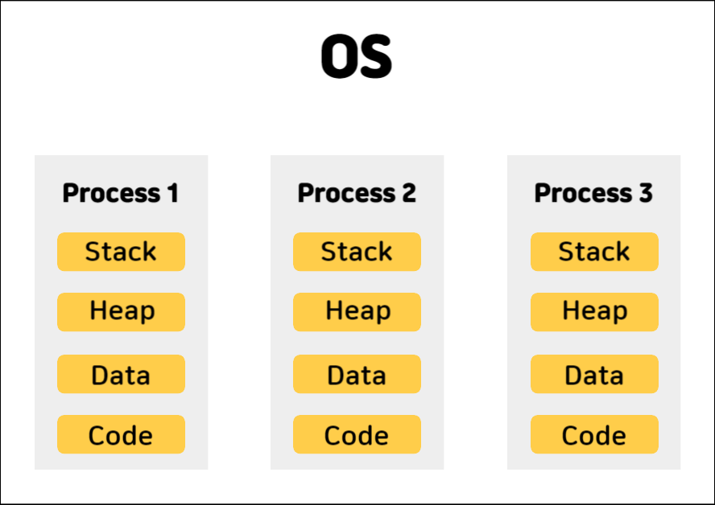
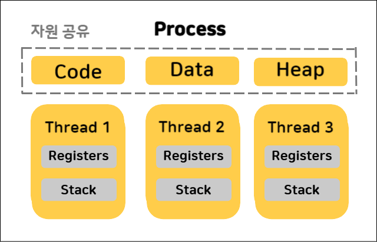
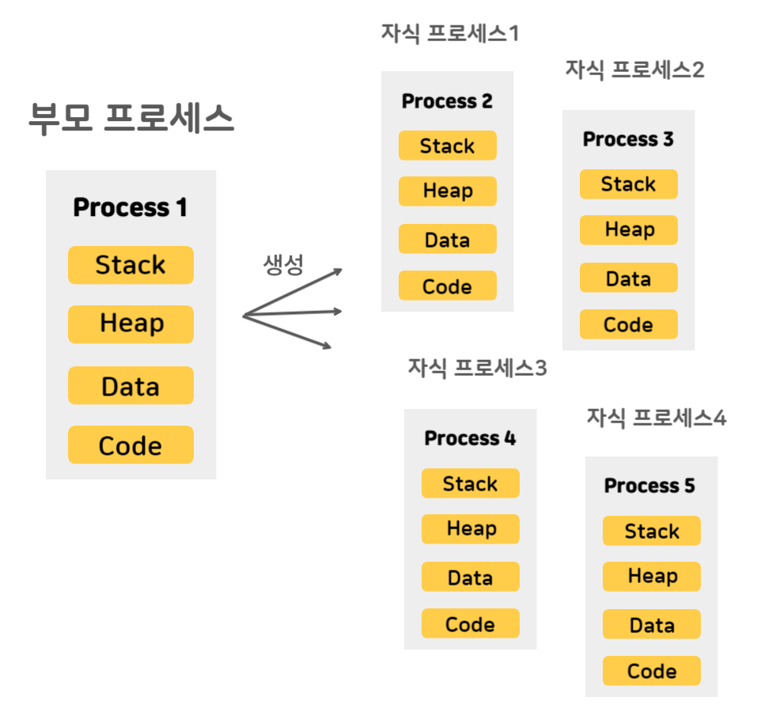
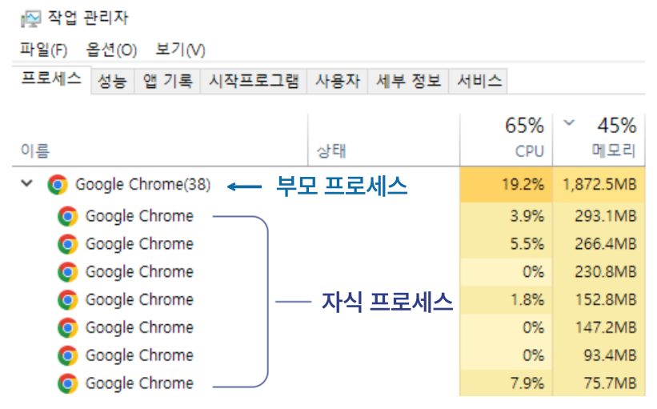
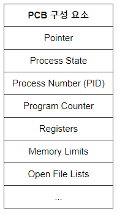

## 1. 프로세스의 개념과 구조
프로세스의 개념에 대해 알아보기 전에 먼저 프로세스와 프로그램의 차이에 대해 알아보겠습니다. <br><br>

| 구분     | 프로그램                                            | 프로세스                                              |
|--------|-------------------------------------------------|---------------------------------------------------|
| **형태** | **실행할 수 있는** 파일                                 | **실행중인** 프로그램                                     |
| **상태** | 파일이 **메모리에 올라가있지 않은** **정적인 상태**                | **메모리에 적재**되고 **CPU 자원을 할당받아** 실행되고 있는 **동적인 상태** |
| **예시** |  |  |

<br><br>

### 프로세스 구조



**Stack 영역**
- 함수 호출 시 생성되는 `지역 변수`, `매개변수`, 반환 주소 등의 임시 데이터를 저장하는 공간입니다.
- 함수 호출과 함께 생성되고 함수가 반환되면 해제됩니다.
- 컴파일 시점에 최대 크기가 결정되지만, 실제 사용량은 런타임에 따라 동적으로 변합니다.

**Heap 영역**
- `동적으로 할당`되는 데이터를 저장하는 공간입니다.
- 사용자에 의해 동적으로 메모리가 할당됩니다.
- **런타임 시점**에 크기가 동적으로 할당되고 해제됩니다.

**Data 영역**
- `전역 변수`와 `정적(static) 변수`가 저장되는 곳입니다.
- Data 영역의 크기는 정적이지만, 내부에 저장된 변수들의 값은 실행 중에 변할 수 있습니다.
- 더 세분화하면 초기화된 데이터는 데이터 영역에, 초기화되지 않은 데이터는 BSS 영역에 저장됩니다.

**Code 영역**
- 실행할 `프로그램의 코드`가 저장되는 영역입니다.
- CPU는 이 영역의 명령어를 순차적으로 가져와 처리합니다.
- 컴파일 시점에 크기가 결정됩니다.

<br>

프로세스 메모리 구조에서 **Stack, Data, Code 영역의 메모리 크기는 컴파일 시 결정**되고,
<br> **Heap 영역의 메모리 크기는 런타임 시 동적으로 할당**됩니다.

Stack과 Heap 영역은 동적 메모리 할당이 가능해 두영역 사이에 빈 메모리 공간이 존재하는데, 이 영역은  
서로 침범할 수 있습니다. 이로 인해 스택 오버플로우(스택이 힙을 침범)나 힙 오버플로우(힙이 스택을 침범)가  
발생할 수 있습니다. <br><br>
```
💡 스택, 힙 오버플로우

Stack Overflow: 주로 재귀 호출이 과도하게 발생하거나 지나치게 큰 지역 변수가 할당될 때 발생
Heap Overflow: 동적 메모리 할당이 과도하게 이루어져 사용 가능한 메모리 공간을 초과할 때 발생
```
<br>

### 프로세스 특징


- `프로세스는 완전히 독립적인 수행단위`라서, 하나의 프로세스에서 발생한 문제는  
  다른 프로세스에게 영향을 주지 않습니다.
- 한 프로세스는 다른 프로세스의 변수나 자료구조에 접근이 불가합니다.
- 이러한 독립성 때문에 프로세스 간 통신을 위해서는 `IPC`(Inter Process Communication)가 사용됩니다.

<br><br>

## 2. 스레드 개념과 구조



<br>

### 스레드 개념

스레드는 한 프로세스 내에서 나뉘어진 하나 이상의 실행 단위이며, 프로세스에 할당된 메모리와 자원을  
공유하며 작업을 수행합니다.

**프로세스는** 운영 체제로부터 CPU 시간과 같은 **자원을 할당받는 더 큰 개념**이며, **실제로 CPU에서 작업을  
수행하는 것은 프로세스 내부의 스레드들**입니다. 그래서 프로세스가 CPU 코어에서 실행되기 위해서는  
최소한 하나의 스레드가 필요합니다. <br><br>

### 스레드 특징
- 스레드는 프로세스 내에서 각각 `Stack`과 `레지스터`를 따로 할당받고, **Code, Data, Heap 영역은 공유**하게 됩니다.
- 이러한 스레드의 `자원 공유`로 인해 한 스레드에서 **오류가 발생하면 같은 프로세스 내의 다른 스레드들도 영향**을 받을 수 있습니다.
- 하나의 스레드가 프로세스의 자원을 수정하면, 동일 프로세스 내의 **다른 스레드들도 변경된 사항을 바로 확인**할 수 있습니다.
<br>

```
💡 스레드마다 별도의 Stack을 할당하는 이유

스레드가 독립적인 함수 호출과 실행 흐름을 유지할 수 있게 하기 위함입니다.
이를 통해 각 스레드는 다른 스레드의 작업에 영향을 받지 않고 독립적으로 실행될 수 있습니다.
```
<br>

### 자바 스레드

기술면접에서 흔히 물어보는 스레드는 OS의 `커널 레벨 스레드`이고, 저희가 쉽게 접할 수 있는 스레드는 `유저 레벨 스레드`인 자바 스레드 입니다.  
**자바 스레드는 JVM(Java Virtual Machine)을 통해 실행**되며, **JVM은 운영체제 상에서 하나의 프로세스로 작동합니다.**  
이 **자바 스레드들은 OS 레벨의 스레드와 1:1로 매핑**되어 실제로 실행되며, 이러한 매핑 덕분에 OS 레벨의 스레드를 간편하게 사용할 수 있습니다. <br><br><br>

## 3. 프로세스 vs 스레드

`프로세스`는 **운영체제로부터 자원을 할당받아 실행하는 독립적인 작업 단위**입니다.  
각 프로세스는 **독립된 메모리 공간(Stack, Heap, Data, Code)을 가지며**, 다른 프로세스와 **자원을 공유하지 않습니다**.  
이로 인해 프로세스 간의 통신을 위해서는 별도의 기법인 IPC가 필요합니다.

반면에, `스레드`는 **프로세스가 할당받은 자원을 이용하여 실행되는 더 작은 단위**입니다.  
하나의 프로세스 안에서 생성된 스레드들은 프로세스의 메모리 공간(Heap, Data, Code)을 공유하지만,  
각 스레드는 고유한 Stack을 가지고 동작합니다. 이 **공유된 자원 구조** 때문에, 같은 프로세스 안에 있는 스레드들 간에는  
데이터 공유가 가능합니다. <br><br><br>

## 4. 멀티 스레드 vs 멀티 프로세스

### 멀티 프로세스

`멀티 프로세스`는 **하나의 응용 프로그램이 여러 개의 프로세스를 동시에 실행**할 수 있게 하는 운영체제의 기술입니다.  
ex) 멀티 프로세스 예시: 크롬 브라우저의 멀티 탭

`💡동시성: 여러 작업이 짧은 시간 간격으로 번갈아가며 수행되어, 마치 동시에 수행하는 것처럼 보이는 것` <br><br>


멀티 프로세스는 다양한 구조 유형들이 존재 합니다.

그 중 하나인 **부모-자식(계층) 구조**
- 이 구조에서는 **하나의 부모 프로세스가 여러 자식 프로세스를 생성함으로써 다중 프로세스 구조를 형성**합니다.  
- 부모 프로세스와 자식 프로세스 모두 고유한 프로세스 ID(PID)를 가지고 있으며, 부모 프로세스는 이 PID를 통해 <br>
자식 프로세스들을 관리하고 제어할 수 있습니다. <br><br>

  <br><br>



<br><br>

#### 멀티 프로세스 장점
- **하나의 프로세스가 에러가 나더라도, 다른 프로세스에 영향을 주지 않아**서 프로그램의 안정성을 확보할 수 있습니다.
#### 멀티 프로세스 단점
- 독립된 메모리 영역이기 때문에 작업량이 많게되면 `Context Switching`이 빈번하게 일어나게 되는데,  
  이 때 오버헤드가 발생할 수 있습니다.
- 이로 인해 멀티 스레드보다 **많은 메모리 공간과 CPU 시간을 차지**합니다.
- 프로세스간에 자원 공유가 필요할 경우 복잡한 통신 기법인 IPC(프로세스 간 통신)를 사용하는데, 이는 성능 저하나 오버헤드를 발생시킬 수 있습니다. <br><br>

<details>
<summary> 💡 Context Switcing(문맥 교환) </summary>
<br>
  
 Context Switching을 하는 주체: 운영체제 스케줄러 <br>
 
**1. 프로세스 컨텍스트 스위칭**
 - 프로세스 간 컨텍스트 스위칭은 CPU가 **하나의 프로세스에서 다른 프로세스로 전환하는 과정**입니다.  
 - 이 과정에서 운영 체제는 현재 실행 중인 **프로세스의 상태**(`PCB`에 저장된 정보)를 **저장**하고, 다음 프로세스의 상태를 CPU에 **로드**합니다.  
 - 이는 상대적으로 무거운 작업으로, **시스템 자원을 상당량 소모**합니다.
 
**2. 스레드 컨텍스트 스위칭**
- 스레드 간 컨텍스트 스위칭은 **같은 프로세스 내의 서로 다른 스레드 사이에서 발생**합니다.  
- 이 과정에서는 각 스레드의 `CPU 레지스터` 상태와 해당 스레드의 `Stack` 정보가 **저장되고 복원**됩니다.  
- 같은 프로세스 내에서 일어나므로, **프로세스 컨텍스트 스위칭에 비해 더 가벼운 작업**으로, 이로 인한  
오버헤드도 상대적으로 적습니다.
</details>
<br>

<details> 
<summary> 💡 PCB(Proccess Control Block) </summary>
<br>
  
PCB는 운영체제에서 프로세스를 관리하기 위해 해당 **프로세스의 상태 및 제어 정보를 저장 하는 자료구조**로,  
**주로 Context Switching시 사용**됩니다. <br>

**PCB는 프로세스 생성 시 함께 만들어지며, 프로세스의 작업 상태를 저장**합니다.  
- 이는 작업이 중단된 후 재개될 때 이전 상태를 복원하는 데 사용되어 **작업이 원활하게 이어질 수 있도록** 합니다.  
- 프로세스가 완료되면 해당 PCB는 제거되어 시스템 자원을 회수합니다. <br><br>

</details>
<br>

### 멀티 스레드


<br>

**하나의 프로세스 내에는 여러 개의 스레드가 존재할 수 있으며**, 이 중 단 하나만 있는 경우를 `싱글 스레드`라고 하고,  
두 개 이상 존재하는 경우를 `멀티 스레드` 구조라고 합니다.

멀티 프로세스의 예로 크롬의 멀티 탭을 들었었는데, 멀티 스레드의 예시로는 크롬의 단일 탭 내에서 네트워크 요청 처리,  
사용자 인터페이스의 I/O 작업, 자바스크립트 이벤트 루프 관리 등과 같은 **다양한 작업들이 여러 스레드에 의해  
동시에 수행**되는 것을 들 수 있습니다. <br><br>

#### 멀티 스레드 장점
- **멀티 프로세스보다 적은 메모리 공간을 차지**하고 **Context Switching이 빠르다**는 장점이 있습니다.
- 스택 영역을 제외한 **메모리 영역을 공유**함으로써, 메모리 사용량을 줄이고 자원 활용도를 높입니다.
#### 멀티 스레드 단점
- 멀티 스레드 구조에서 **여러 개의 스레드가 공유 자원에 동시에 접근**할 수 있는데, 이때 `동기화 문제`가 발생할 수 있습니다.
  - **Race Condition**(경쟁 상태): **여러 스레드가 동시에 같은 자원에 접근하려 할 때 발생**하는데,
    이는 성능 저하로 이어질 수 있습니다.
  - **Dead Lock**(교착 상태): **스레드들이 동시에 상대방이 사용 중인 자원을 요청**하면서 **서로가 서로를 기다리는 상태**인
    데드락이 발생할 수 있는데, 이는 시스템 정지를 초래할 수 있습니다.
- **하나의 스레드의 문제가 생기면 해당 프로세스 전체에 영향**을 미칠 수 있습니다.
  <br> <br>

```
💡 멀티 스레드에서 동시 접근 제어: 뮤텍스 사용

멀티 스레드 환경에서 뮤텍스는 공유 자원에 대한 동시 접근을 제어하는 역할을 합니다. 
한 스레드가 특정 자원을 사용할 때 다른 스레드의 접근을 차단함으로써, 
데이터의 무결성을 보장하고 Race Condition을 예방할 수 있습니다.
```

<br><br>

---
#### 🔖 Reference.
[완전히 정복하는 프로세스 vs 스레드 개념](https://inpa.tistory.com/entry/%F0%9F%91%A9%E2%80%8D%F0%9F%92%BB-%ED%94%84%EB%A1%9C%EC%84%B8%EC%8A%A4-%E2%9A%94%EF%B8%8F-%EC%93%B0%EB%A0%88%EB%93%9C-%EC%B0%A8%EC%9D%B4)  
https://8iggy.tistory.com/178  
[[기술면접] 프로세스](https://velog.io/@uddiyam/%EA%B8%B0%EC%88%A0%EB%A9%B4%EC%A0%91-%ED%94%84%EB%A1%9C%EC%84%B8%EC%8A%A4)  
https://girawhale.tistory.com/61  
https://easy-code-yo.tistory.com/36  
https://www.youtube.com/watch?v=1grtWKqTn50&t=846s  
[Inpa Dev 멀티 프로세스 vs 멀티 스레드 비교 완전 총정리](https://inpa.tistory.com/entry/%F0%9F%91%A9%E2%80%8D%F0%9F%92%BB-multi-process-multi-thread)  
https://github.com/JaeYeopHan/Interview_Question_for_Beginner/tree/main/OS  
https://soopeach.tistory.com/252  
